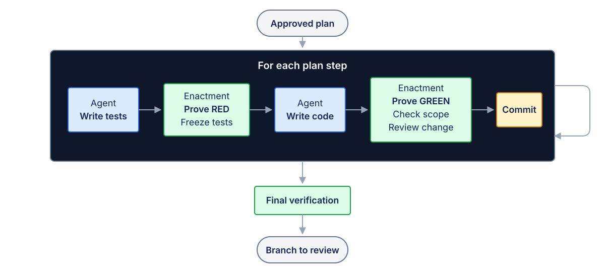

# Enactment

Enactment turns an approved software-development plan into verified Git commits. Coding agents do
the work in hardened containers. No step lands until fixed gates accept it.

## The problem

Coding agents are effective at individual tasks. A multi-step plan adds a different problem: safe
progression. Each step must start from the accepted result of the previous step, stay within scope,
pass independent checks, and leave enough evidence to audit or recover it.

Interactive sessions leave much of that coordination to a person. Enactment makes it part of the
execution system.

## What Enactment does

You approve the plan once. Enactment then implements every step without you. It gives you one
branch to review at the end.

It can run without you because each step must pass fixed gates. For a code-behavior step:

- the new test fails first, for the declared reason;
- the harness freezes the test;
- the new code makes the test pass;
- the change touches only the declared files;
- a scanner finds no new blocking defect.

A retryable failure can get one controlled retry. If a gate still fails, the plan stops. Enactment
does not continue and hope.

Enactment is not an agent. It supervises agents. Codex CLI and Claude Code are interchangeable
engines inside it.

## How a plan runs

Enactment runs the steps in the written order. Each step starts at the commit that the step before
it made. Code-behavior steps must support a test-first red/green cycle. Operational `task` steps do
not require TDD. A code-behavior step follows this path:



The agents only write tests and implementation. Enactment owns every gate, the plan branch, and the
commits. Any failed gate stops the plan with evidence. A `task` step skips the test-specific path.
An eligible failure gets one policy-controlled retry.

## Example

The published demo adds a task-summary function, then exposes it over HTTP:

```yaml
version: 1
id: task-summary
steps:
  - type: code_behavior
    id: summarize-tasks
    implementation_paths: [src/summary.js]
    test_paths: [test/summary.test.js]
    # complexity, risk, behavior, expected tests and verification are in demo/plan.yml
  - type: task
    id: summary-endpoint
    implementation_paths: [src/server.js]
    # includes a live HTTP runtime check
```

It creates `enactment/task-summary`. Each commit records its origin:

```text
summarize-tasks: apply enactment-verified changes

Enactment-Plan: task-summary
Enactment-Step: summarize-tasks
Enactment-Attempt: <attempt-id>
Enactment-Idempotency-Key: sha256:<hash>
```

Evidence is separate from the Git branch:

```text
artifacts/task-summary/
  final/run-1/
  reports/invocation-1.json
  steps/
    summarize-tasks/<attempt-id>/run-1/
    summary-endpoint/<attempt-id>/run-1/
```

Run the credential-free replay:

```sh
npm ci
npm run images:build
npm run demo:replay
```

The replay uses recorded answers. It proves the control plane, not model capability. See
[`demo/README.md`](demo/README.md). Demo output is human-readable. The complete report remains at
the printed `artifacts/task-summary/reports/invocation-<n>.json` path.

Measured from a clean clone on the development host with `npm run demo:replay`: the first replay
took 31.29 seconds; the second, with the dependency cache warm, took 27.14 seconds.

## Compared to an interactive coding agent

| | Interactive agent | Enactment |
| --- | --- | --- |
| Execution unit | one task or session | an approved, ordered plan |
| Progression | decided during the session | decided by fixed gates |
| Durable state | working tree and session history | SQLite, artifacts, and Git commits |
| Human role | directs or reviews the session | approves the plan, then reviews the branch |
| Output | proposed changes | verified commits on a dedicated branch |

Enactment runs Claude Code and Codex CLI inside it. It cannot ask you during a run, so it proves
the result instead. It comes back to you only when it stops: a new dependency, a new documentation
source, a disputed test contract, or a failure that survived the retry. Each one needs a new plan
revision.

## Status

**Use Enactment only on repositories you trust.**

Version 0.1.0. Everything on this page works today.

Enactment runs Node.js projects. It needs Docker or OrbStack on one host, and it runs one plan at a
time on that machine.

Not supported: untrusted repositories, Kubernetes, parallel agents, remote workers, automatic
merge, live external API calls.

## How it works

**Isolation.** Each phase runs in a disposable container. The container has no host home, no
canonical Git, no Docker socket, and no added capabilities. It runs as a non-root user with a
read-only root filesystem. Docker is the security boundary.

**Network.** A CONNECT proxy allows exact hostnames only. The verifier and the reviewer run
offline. Each phase gets its own network, which the harness destroys afterwards.

**Tests first.** The agent writes the tests. The harness proves that they fail for the declared
reason. It then freezes the tests and the runner configuration. A second agent writes the code.

**Scope.** Each step declares which files it may change. The harness rejects any change outside
that scope. Agents cannot change dependencies.

**Verification.** Tests run again in a fresh offline container with clean dependencies. Commands
are fixed argument arrays. The harness never runs a shell string that a model produced.

**Runtime check.** A step can start its application in a private offline network and check its
behavior over HTTP.

**Review.** A pinned Semgrep scan compares the changed files before and after. Only new findings
count. Critical findings always block. Warnings block high-risk steps.

**Git.** The harness owns Git. It commits to `enactment/<plan-id>`, with hooks disabled and an
expected old value on the ref. Commits carry `Enactment-Plan`, `Enactment-Step`,
`Enactment-Attempt` and `Enactment-Idempotency-Key` trailers. It never merges and never pushes.

**Recovery.** SQLite holds the plan state. After a crash, the harness reconciles the database, the
branch, the commit trailers and the artifacts. A commit that exists but was not recorded completes
without a rerun.

**Routing.** Each step declares its complexity. Low goes to Codex at medium effort. Medium goes to
Claude Sonnet at medium effort. High goes to Codex at high effort. One failure gets one diagnosis
and one stronger retry, both on Claude Opus at high effort. These routes are harness policy, not
settings: a plan cannot change the provider, the model or the effort. To change them, edit the
source and rebuild. That changes the approval hash, so every manifest needs a new approval.

**Evidence.** Every attempt writes artifacts: prompts, redacted events, container logs, proxy
records, and the results of `baseline`, `tests`, `red`, `implementation`, `green`, `verify`,
`runtime` and `review`.

## Try it live

You need Docker or OrbStack, Node.js 22.13 or later, and provider subscriptions. Run `codex login`
once. For Claude steps, run `claude setup-token` once and store the token as `RUNBOOK.md` describes.
Build the runtime images first, then run the same project and plan with live providers:

```sh
npm run images:build
npm run demo
```

This command uses real credentials and provider quota. Results are nondeterministic. It keeps the
temporary repository, plan database, artifacts, and detailed report, then prints their locations.

For lower-level operator control, prepare and run a repository directly:

```sh
repo=$(mktemp -d)
cp -R demo/repo/. "$repo/"
git -C "$repo" init -q -b main
git -C "$repo" add -A
git -C "$repo" -c user.name=Demo -c user.email=demo@enactment.invalid \
  commit -q -m 'Initial task board'

node dist/cli.js prepare demo/plan.yml --repo "$repo" --output "$repo/manifest.yml"
node dist/cli.js run "$repo/manifest.yml" --repo "$repo"
```

`prepare` writes the approval. Running the manifest is the approval. Direct CLI commands write
JSON to stdout; demo commands write a human-readable progress and evidence tour.

## Documentation

- [DESIGN.md](DESIGN.md) — the design, the trust model, and the measured findings that changed each
  decision.
- [RUNBOOK.md](RUNBOOK.md) — how to declare a plan, run it, read the artifacts, and recover.

## Not in V1

No planner. No automatic merge. No web interface. No local models. No parallel steps.

The review gate is a deterministic check, not proof of security, and not a replacement for reading
the branch.

## License

Apache-2.0. See [LICENSE](LICENSE).

Copyright 2026 Ilya Lavrov.

The reviewer ships third-party Semgrep rules under MIT and LGPL-3.0. See
[images/reviewer/rule-packs/THIRD_PARTY_NOTICES.md](images/reviewer/rule-packs/THIRD_PARTY_NOTICES.md).
